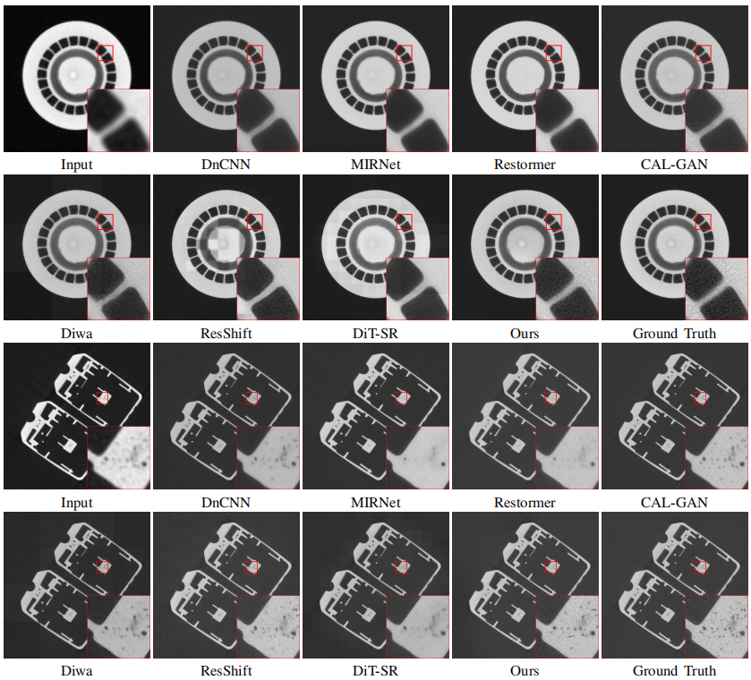

# Towards Real-World Image Super-Resolution for Industrial CT: A New Dataset and Method
This repository accompanies our work on real-world industrial computed tomography (ICT) image super-resolution.
We introduce **ICT-SR**, a real-world paired dataset, and an efficient conditional diffusion framework for recovering fine structural details in ICT images.
## 📖 Overview
Industrial CT faces a trade-off between spatial resolution and inspection efficiency. Learning-based super-resolution offers a software-based approach to improving image quality, but its practical application is limited by the scarcity of real-world paired datasets and the computational cost of existing methods.

This work addresses these challenges through hardware-controlled data acquisition and an efficient diffusion-based reconstruction framework.

## ICT-SR Dataset
ICT-SR contains single-channel, 16-bit industrial CT images of components made from aluminum alloys, titanium alloys, and steel.

Low-resolution and high-resolution pairs are obtained through hardware-controlled acquisition rather than synthetic downsampling.

## 🔍 Visual Comparison

## Code Availability

Source code, pretrained models, and instructions for training and inference will be added upon release.

## Citation

Citation information will be added when the paper becomes publicly available.

